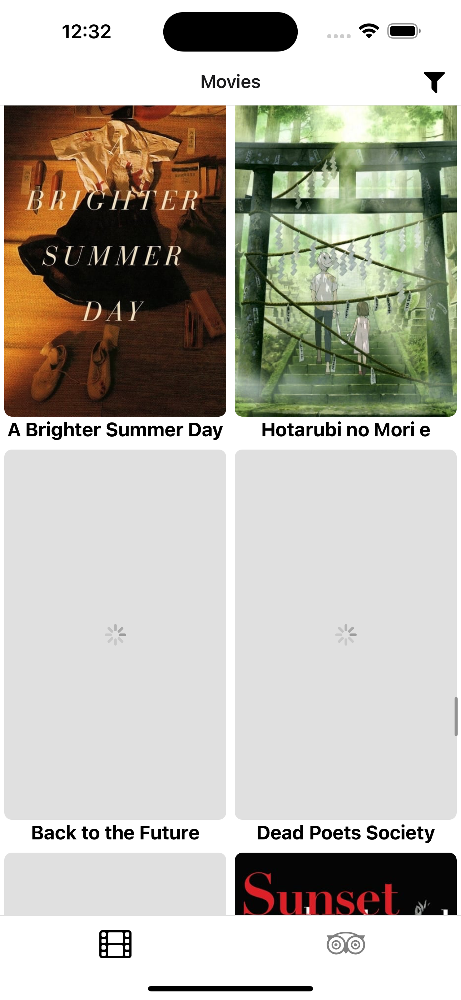
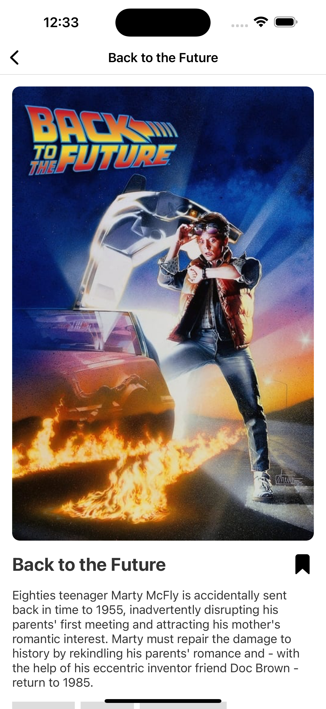
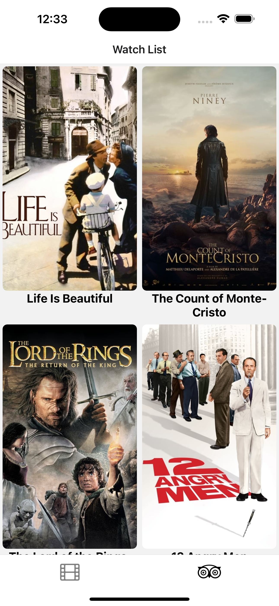
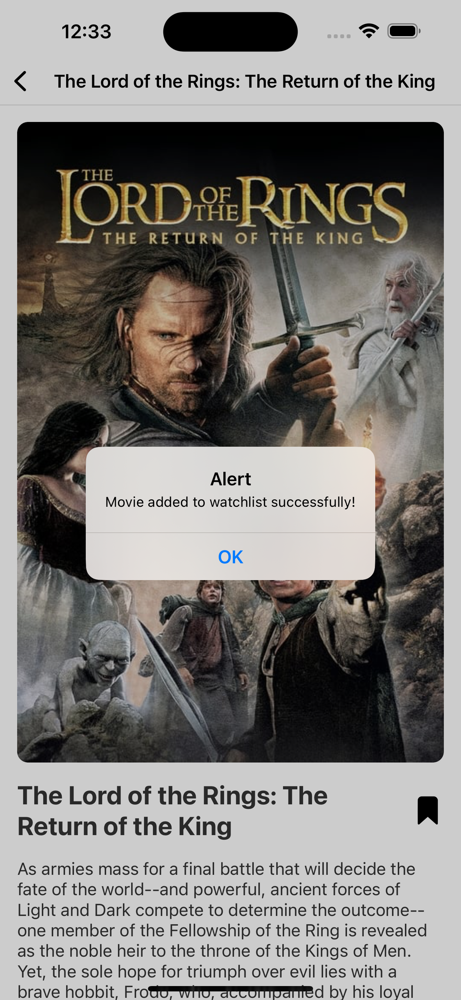

## Movie List App

This project is a Movie List App built with React Native and Expo. It features infinite scroll for loading movies, a picker for filtering or sorting movies, and optimized performance for large datasets.

# Features

Infinite Scroll: Movies load dynamically as you scroll down.
Picker Filter: Filter or sort movies by different options using a picker component.
Optimized Performance: Reduced unnecessary re-renders and optimized data fetching for smooth scrolling with large movie lists.

# Screenshots

# Installation

- Clone the repository:

git clone https://github.com/your-username/movie-list-app.git

- Navigate into the project directory:

cd movie-list-app

- Install the dependencies:

npm install or yarn install

- Start the Expo server:

expo start
